# Modelo de datos · V1

> 8 de octubre de 2026 · PostgreSQL 17 con pgvector · Migración: [V1__esquema_inicial.sql](../backend/src/main/resources/db/migration/V1__esquema_inicial.sql)

Cubre las tres vistas del [Product Backlog](backlog.md): la persona (plan individual gratis), la empresa (plan pago) y la administración de Xpedia. Incluye las propuestas P1, P2, P3 y P6 del apéndice del backlog, que el [prototipo](../prototipo/README.md) ya usa.

## Convenciones

- Todo en español y snake_case, sin tildes ni ñ en los nombres. Tablas en singular.
- PK `id uuid` con `gen_random_uuid()`. Todas las tablas llevan `creado_en`; las que se editan también llevan `actualizado_en`.
- Estados y tipos son `text` + `CHECK` con valores en mayúsculas (`'BORRADOR'`). En Java se mapean con `@Enumerated(EnumType.STRING)`.
- **`organizacion_id` NULL = contenido global de Xpedia**; con valor, es contenido propio de una empresa. Aplica a `habilidad`, `puesto`, `fuente`, `ruta`, `rubrica` y `punto_clave`.
- Lo estructural (ruta, hito, rama, nodo, pregunta) va en tablas. La definición de cada mecánica (texto de la microlección, pasos del escenario, personaje del roleplay, consigna del reto) va en `actividad.contenido` (JSONB), así se suman mecánicas sin migrar.
- Las cuentas de empresa no son un tipo de usuario: son personas con `miembro_organizacion.rol = 'ADMIN'`. `usuario.tipo` solo distingue a los administradores de Xpedia.

## Diagrama

```mermaid
erDiagram
    usuario ||--o{ miembro_organizacion : ""
    organizacion ||--o{ miembro_organizacion : ""
    organizacion ||--o{ suscripcion : ""
    plan ||--o{ suscripcion : ""
    puesto |o--o{ miembro_organizacion : ""
    puesto ||--o{ puesto_habilidad : ""
    habilidad ||--o{ puesto_habilidad : ""

    organizacion ||--o{ documento : ""
    documento ||--o{ fragmento_documento : ""
    fragmento_documento |o--o{ punto_clave : ""
    fuente |o--o{ punto_clave : ""

    ruta ||--o{ hito : ""
    ruta ||--o{ rama : ""
    hito |o--o{ nodo : ""
    rama |o--o{ nodo : ""
    habilidad |o--o{ nodo : ""
    nodo ||--o{ nodo_prerrequisito : ""
    nodo |o--o{ actividad : ""
    rubrica ||--o{ rubrica_criterio : ""
    rubrica |o--o{ actividad : ""
    actividad ||--o{ pregunta : ""
    actividad ||--o{ actividad_fuente : ""
    fuente ||--o{ actividad_fuente : ""
    actividad ||--o{ actividad_punto_clave : ""
    punto_clave ||--o{ actividad_punto_clave : ""

    organizacion ||--o{ asignacion_ruta : ""
    ruta ||--o{ asignacion_ruta : ""
    organizacion ||--o{ tutoria : ""

    usuario ||--o{ inscripcion : ""
    ruta ||--o{ inscripcion : ""
    asignacion_ruta |o--o{ inscripcion : ""
    inscripcion ||--o{ progreso_nodo : ""
    inscripcion ||--o{ nodo_agregado : ""
    inscripcion ||--o{ sesion : ""
    sesion |o--o{ intento : ""
    actividad ||--o{ intento : ""
    intento ||--o{ respuesta : ""
    pregunta ||--o{ respuesta : ""
    intento ||--o{ intento_punto_clave : ""
    inscripcion ||--o{ informe : ""
    inscripcion ||--o{ cambio_roadmap : ""
    informe |o--o{ cambio_roadmap : ""
    usuario ||--o{ evidencia : ""
    usuario ||--o{ actividad_diaria : ""

    nodo |o--o{ novedad : ""
    novedad ||--o{ novedad_inscripcion : ""
    inscripcion ||--o{ novedad_inscripcion : ""
    usuario ||--o{ conversacion_coach : ""
    conversacion_coach ||--o{ mensaje_coach : ""
    usuario ||--o{ notificacion : ""
    usuario ||--o| conexion_github : ""
```

## Tablas

**Cuentas, empresas y planes**

| Tabla | Para qué | PBI |
|---|---|---|
| `usuario` | La persona. `tipo` separa a los administradores de Xpedia. `portfolio_slug` es el link público del portfolio. | 1, 25, 51 |
| `organizacion` | La empresa cliente. Se puede suspender. | 47 |
| `plan` | Plan individual o de empresa, precio por usuario y límites diarios de práctica con IA y de consultas al coach. | 48, 49 |
| `suscripcion` | Qué plan tiene cada empresa y cuántos usuarios contrató. Una sola activa por empresa. | 48 |
| `miembro_organizacion` | Quién pertenece a qué empresa, con qué rol (ADMIN/MIEMBRO), puesto y área. | 33 |

**Competencias**

| Tabla | Para qué | PBI |
|---|---|---|
| `habilidad` | Catálogo de habilidades, con referencia a O\*NET/ESCO. | 34 |
| `puesto` | Puesto de trabajo ("Chat N1", "Escalamiento N2"). | 34 |
| `puesto_habilidad` | Nivel esperado (0-3) de cada habilidad por puesto. Es la matriz de competencias. | 34, 37 |

**Fuentes y documentos**

| Tabla | Para qué | PBI |
|---|---|---|
| `fuente` | Material de referencia con licencia, uso (ADAPTABLE o SOLO_ENLACE) y si permite uso comercial. | 15 |
| `documento` | Documento cargado por una empresa. | 35 |
| `fragmento_documento` | Fragmento con página y `embedding vector(1536)`. Da la trazabilidad de los puntos clave y la búsqueda del coach. | 35, 14 |

**Rutas**

| Tabla | Para qué | PBI |
|---|---|---|
| `ruta` | El roadmap: tipo, objetivo, meta, país y ritmo recomendado. Versionada. `validacion` es el sello (borrador de IA o revisada). `EN_ARMADO` y `confirmada_en` cubren el armado con la empresa. | 3, 8, 17, 36, 50 |
| `hito` | Etapa de la ruta con su evidencia esperada. `estado_propuesta` marca los hitos que la empresa pidió ajustar. | 5, 36 |
| `rama` | Rama del árbol de habilidades. Las opcionales son bifurcaciones que no frenan la ruta principal. | 26, P3 |
| `nodo` | Nodo del árbol (`A3`). `TEMA` es un tema fuera del recorrido, sin hito, que entra por interés o por una novedad. `palabras_clave` sirve para emparejar novedades e intereses. | 6, 26, P2 |
| `nodo_prerrequisito` | Grafo de prerrequisitos entre nodos. Define qué se desbloquea y dónde ubicar un tema nuevo. | P1 |

**Actividades y evaluación**

| Tabla | Para qué | PBI |
|---|---|---|
| `actividad` | Lo que la persona hace: diagnóstico, microlección, cuestionario, escenario, roleplay, ensayo, reto con proyecto, desafío real, lectura o prueba final. Se genera una vez por nodo, tipo y nivel y se reutiliza. No se publica hasta que `estado_revision = 'APROBADA'`. | 4, 11, 13, 16, 17, 18-24 |
| `pregunta` | Pregunta de opción múltiple con su explicación. En el diagnóstico, `nodo_id` indica qué nodo mide. | 4, 12 |
| `rubrica` / `rubrica_criterio` | Rúbricas reutilizables entre hitos. Un criterio `eliminatorio` en 0 desaprueba aunque el total alcance. | 21, 24 |
| `punto_clave` | Regla o concepto evaluable, trazado a su fuente o al fragmento y la página del documento. | 35, 41 |
| `actividad_fuente` | Qué fuentes cita cada actividad y dónde (`pág. 3`). | 11 |
| `actividad_punto_clave` | Qué puntos clave evalúa cada actividad. | 41 |

**Empresa**

| Tabla | Para qué | PBI |
|---|---|---|
| `asignacion_ruta` | Ruta asignada a un puesto o a una persona (exactamente uno de los dos). | 39 |
| `tutoria` | Tutor de la empresa o de la comunidad asignado a una empresa y ruta. | 44 |
| `calificacion_tutor` | Calificación de 1 a 5 que la comunidad le da a un tutor. | 44 |

**Progreso de la persona**

| Tabla | Para qué | PBI |
|---|---|---|
| `inscripcion` | La persona recorriendo una ruta, con su meta personal, ritmo, llegada estimada y diagnóstico. Una sola abierta por ruta, pero puede haber varias rutas. | 3, 4, 8, 9 |
| `progreso_nodo` | Estado de cada nodo, `dominio` de 0 a 1, nivel, fallos y próximo repaso. | 6, 7, 12 |
| `nodo_agregado` | Lo que la persona sumó a su roadmap: novedades, intereses (con texto libre) o ajustes. `decision` dice si entró ahora, se agendó para un hito, es una rama o se guardó. Se puede deshacer. | 32, P2, P3 |
| `sesion` | La sesión diaria con sus pasos (repaso, microlección, práctica, cierre). | 10 |
| `intento` | Cada vez que hace una actividad: modo (PRACTICA/VALIDACION), puntaje, feedback y detalle en `resultado`. El audio vence a los 30 días. | 18-24, 27 |
| `respuesta` | Cada respuesta con su confianza (`SABIA`, `DUDE`, `ADIVINE`) y el tiempo que tardó. | 4, 7 |
| `intento_punto_clave` | Si acertó cada punto clave. De acá sale "los puntos clave más fallados". | 41, 42 |
| `informe` | Informe periódico con avance, dificultades, novedades y próximos pasos. | P6 |
| `cambio_roadmap` | Historial del roadmap vivo. Las propuestas quedan en `PROPUESTO` hasta que la persona las acepta o rechaza. | 7, P6 |
| `evidencia` | El portfolio: pruebas finales, rúbricas, proyectos, trabajo en GitHub, desafíos reales y certificados externos. | 25, 41 |
| `actividad_diaria` | Minutos, XP, prácticas con IA y consultas al coach por día. Con esto se calculan la racha y el límite diario. | 28, 29, 49 |

**Novedades, coach y avisos**

| Tabla | Para qué | PBI |
|---|---|---|
| `novedad` | Novedad del rubro, relacionada con un nodo. | 30 |
| `novedad_inscripcion` | Cómo le llega a cada persona: para ahora, retenida hasta un hito (con el motivo), sumada o descartada. | 30, 31, 32 |
| `conversacion_coach` / `mensaje_coach` | Consultas al coach de IA, con las fuentes citadas en cada respuesta. | 14 |
| `notificacion` | Recordatorios, repasos, atrasos, resumen semanal, novedades e informes, por app o por mail. | 28, 45 |
| `conexion_github` | Cuenta de GitHub conectada para verificar commits y sitios publicados. | 22 |

## Consultas que el modelo tiene que responder

- **Brecha por puesto:** `puesto_habilidad.nivel_esperado` menos el nivel medido en `progreso_nodo` (unido por `nodo.habilidad_id`).
- **Puntos clave más fallados:** `intento_punto_clave` agrupado por `punto_clave_id`, con el porcentaje de `correcto = false`.
- **Repaso del día:** `progreso_nodo` con `proximo_repaso_en <= now()`.
- **Nodos desbloqueados:** un nodo está disponible cuando todos sus `nodo_prerrequisito` tienen `dominio` suficiente en `progreso_nodo`.
- **Novedades que se liberan:** al cambiar `inscripcion.hito_actual_id`, las `novedad_inscripcion` en `RETENIDA` de ese hito pasan a `PARA_AHORA`.
- **Límite diario de IA:** `actividad_diaria.practicas_ia` de hoy contra `plan.limite_practicas_ia_diarias` del plan que corresponde a la persona.
- **Privacidad:** la empresa solo ve agregados de grupos de 5 personas o más, y de cada persona solo el estado de los hitos y la prueba final. Esa regla vive en la capa de servicio, no en el esquema.

## Queda para después

- Cohortes y compañeros con el mismo objetivo.
- Comunidad y creadores de contenido.
- Detección de ineficiencias (P4) y calibración del agente evaluador (P5): por ahora se calculan a partir de `respuesta` e `intento`, sin tablas propias.
