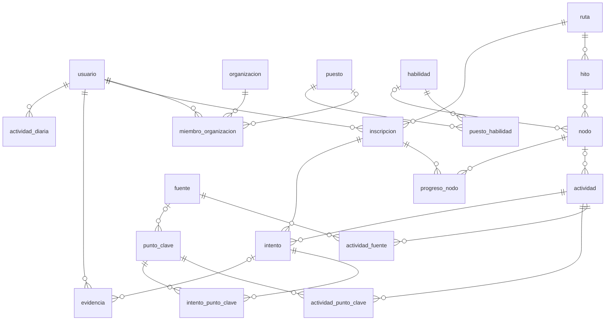

# Modelo de datos · V1

> 3 de octubre de 2026 · PostgreSQL 17 · Migración: [V1__esquema_inicial.sql](../backend/src/main/resources/db/migration/V1__esquema_inicial.sql)

Cubre al usuario individual y la base para empresas: organización, puestos y competencias esperadas. Los documentos de empresa con embeddings quedan para V2.

## Convenciones

- Todo en español y snake_case, sin tildes ni ñ en los nombres. Tablas en singular.
- PK `id uuid` con `gen_random_uuid()`. Todas las tablas llevan `creado_en`; las que se editan también llevan `actualizado_en`.
- Estados y tipos son `text` + `CHECK` con valores en mayúsculas (`'BORRADOR'`). En Java se mapean con `@Enumerated(EnumType.STRING)`.
- **`organizacion_id` NULL = contenido global de Xpedia**; con valor, es contenido propio de una empresa. Aplica a `habilidad`, `puesto`, `fuente`, `ruta` y `punto_clave`.
- Lo estructural (ruta, hito, nodo) va en tablas. La definición de cada mecánica (pasos del ticket, turnos del roleplay, preguntas del diagnóstico) va en `actividad.contenido` (JSONB), así se suman mecánicas sin migrar.

## Diagrama

## Tablas

**Identidad y empresas**

| Tabla | Para qué |
|---|---|
| `usuario` | La persona. `hash_contrasenia` es opcional, por si después se suma OAuth. |
| `organizacion` | La empresa cliente y su plan. |
| `miembro_organizacion` | Quién pertenece a qué empresa, con qué rol (ADMIN/MIEMBRO) y en qué puesto. |

**Competencias**

| Tabla | Para qué |
|---|---|
| `habilidad` | Catálogo de habilidades, con referencia a O\*NET/ESCO. |
| `puesto` | Puesto de trabajo ("Chat N1", "Escalamiento N2"). |
| `puesto_habilidad` | Nivel esperado (0-3) de cada habilidad por puesto. Es la matriz de competencias. |

**Contenido de rutas**

| Tabla | Para qué |
|---|---|
| `fuente` | Material de referencia, con licencia y uso (ADAPTABLE o SOLO_ENLACE). |
| `ruta` | El roadmap: tipo, objetivo, meta y ritmo recomendado. Versionada. |
| `hito` | Etapa de la ruta. `es_final` marca el "jefe". |
| `nodo` | Nodo del árbol de habilidades (`A3`), con su rama y el hito donde se trabaja. |
| `actividad` | Lo que el usuario hace: lección, ticket, roleplay, ensayo, desafío real, lectura o diagnóstico. Se genera una vez por habilidad y nivel y se reutiliza. |
| `actividad_fuente` | Qué fuentes cita cada actividad y dónde (`pág. 3`). |
| `punto_clave` | Regla o concepto evaluable, trazado a su fuente y página. |
| `actividad_punto_clave` | Qué puntos clave evalúa cada actividad. |

**Progreso del usuario**

| Tabla | Para qué |
|---|---|
| `inscripcion` | El usuario recorriendo una ruta, con su ritmo y su diagnóstico. Si la asignó una empresa, lleva `organizacion_id`. |
| `progreso_nodo` | Estado de cada nodo (BLOQUEADO … DOMINADO, PROBADO_REAL, OXIDADO), su nivel y la fecha del próximo repaso. |
| `intento` | Cada vez que hace una actividad: modo (PRACTICA/VALIDACION), puntaje y detalle en `resultado` (JSONB). El audio vence a los 30 días. |
| `intento_punto_clave` | Si acertó cada punto clave y si estaba seguro. Sale de acá "los puntos clave más fallados". |
| `evidencia` | El portfolio: rúbricas aprobadas, proyectos, desafíos reales y certificados externos. |
| `actividad_diaria` | Minutos y XP por día. La racha se calcula de acá. |

## Consultas que el modelo tiene que responder

- **Brecha por puesto:** `puesto_habilidad.nivel_esperado` menos el nivel medido en `progreso_nodo` (unido por `nodo.habilidad_id`).
- **Puntos clave más fallados:** `intento_punto_clave` agrupado por `punto_clave_id`, con el porcentaje de `correcto = false`.
- **Repaso del día:** `progreso_nodo` con `proximo_repaso_en <= now()`.
- **Privacidad:** la empresa solo ve agregados de grupos de 5 personas o más. Esa regla vive en la capa de servicio, no en el esquema.

## Queda para V2

- `documento` y `fragmento_documento` con `vector(1536)` (pgvector) para los documentos de empresa y la generación de puntos clave por IA.
- Cohortes, conexión con GitHub, perfil público compartible y planes de pago.
